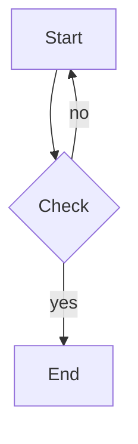

+++
date = '2026-09-06T21:00:00+08:00'
draft = false
title = 'liepress 0.2 发布：改了架构，加了图表'
+++

## 前言

前阵子写的[liepress](https://github.com/zzzdong/liepress)，是把 markdown 转成 pdf 的小工具。最近给它发了 [0.2](https://crates.io/crates/liepress) 版本，改动不小：架构重做了一遍，还顺手把图表支持加上了。

这篇文章就简单记一下，0.2 到底改了啥。

## 新版本

```shell
liepress -i document.md -o document.pdf
liepress -i document.md -o document.svg -f svg
liepress -i document.md -o document.png -f png
liepress -i document.md -o document.docx -f docx
```

用法没什么变化，还是 `cargo install liepress` 就能装上。变化都在里面：

- 架构改成了 `dom` → `ast` → `document` → 输出后端的分层。
- 支持 `mermaid` 和 `liecharts` 代码块，可以画一些图。
- 渲染基元统一到[lievisual](https://crates.io/crates/lievisual)，跟[liecharts](https://crates.io/crates/liecharts)、[liemermaid](https://crates.io/crates/liemermaid) 用同一套。

## 改架构

0.1 的时候，基本就是「解析 markdown → 排版 → 画到 pdf」一条道走到黑，pdf 的逻辑和排版的逻辑搅在一起，想加个新的输出格式就很难受。

于是参考了 [typst](https://github.com/typst/typst) 的思路——它是 markup 进来，先变成内容树，再排版成 frame，最后才交给导出后端。我也照着切了几层：

```
输入 (.md / .html)
      │
      ▼
   dom        HtmlElement 树 + CSS 级联（ResolvedStyle）
      │
      ▼
   ast        简化的带样式 AST：Node / NodeKind / Style
      │
      ▼
 enrich       外绘（mermaid/liecharts → 内嵌图片）+ 代码高亮
      │
      ▼
 document     不分页的块树：Document / Block / TextLine
      │
      ▼
  output      pdf(krilla) / svg / png / html / docx
```

其中最重要的是一条：**Document 不知道页（Document is page-agnostic）**。

`Document` 是一棵不分页的块树，每个块带着已经解析好的样式；分页是各个输出后端自己的事。pdf 后端自己切页，svg/png 干脆不切，html 流式，docx 交给 Word 自己排。这样一份 `Document` 可以喂给所有后端，加新后端时也不用再抄一遍分页逻辑。

另外，把「外绘」和「语法高亮」提到了 AST 的富化阶段（enrich），一次性做完，产物直接挂在 AST 节点上。这样 mermaid 图和着色后的代码，在 pdf/svg/png/html/docx 里都一样有——不然每个后端各画一遍，那才叫灾难。

## 图表

写文档总要画点图，于是加了两个渲染器，都是用代码块的语言标签来触发：

````markdown


```liecharts
{"title":{"text":"Sales"},"xAxis":[{"type":"category","data":["Jan","Feb","Mar"]}],
"yAxis":[{"type":"value"}],"series":[{"type":"bar","data":[120,200,150]}]}
```
````

- [liemermaid](https://github.com/zzzdong/liemermaid)：纯 Rust 的 mermaid 解析+渲染，目前支持 flowchart、sequence、class、state、ER、pie、gitgraph、timeline。
- [liecharts](https://github.com/zzzdong/liecharts)：受 ECharts 启发的图表库，配置是 ECharts 风格的 JSON，支持 line、bar、pie、area、scatter、radar、gauge、candlestick、boxplot、heatmap 等。

两者都在 AST 富化阶段被渲染成内嵌的 PNG，就地替换成图片节点，所以五个输出后端都带图。渲染失败也不会炸，只是退化成原来的代码块，加一行注释。

它们由 `charts` / `mermaid` 两个 feature 控制，默认都开着；不想要就 `--no-default-features`，编译会轻不少。

## 统一到 lievisual

最开始，liepress 里有一个简陋的 visual 系统，本来是从别的项目搬过来调试用的（可以输出 svg，方便我把分页结果丢给 AI 看）。后来写 liecharts、liemermaid 的时候，发现三边都在做同样的事情：几何、颜色、文本排版、画到 svg/png。

干脆抽出来做成[lievisual](https://crates.io/crates/lievisual)：一份声明式的 `Scene` IR（图元 + 文本），底下挂不同的渲染后端（SVG、基于 `vello_cpu` 的 PNG 栅格化）。

现在的分工就清爽了：

- `liecharts` / `liemermaid` 只管把图和表算成 `Scene`。
- `liepress` 的 svg/png 后端，则是把 `Document` 投影成 `Scene`（`document_to_scene`，全程 pt 坐标系，最后乘个 scale 归一到像素）。
- 谁都不碰具体的 svg 字符串和像素缓冲。

顺带的好处是，调试的时候输出一份 svg，肉眼能看，AI 也能读。

## 来试一试

还是老地方，有[在线转换](https://zzzdong.github.io/liepress/)可以玩，粘贴一段 markdown 就能出 pdf。图表的效果也可以在[liecharts](https://zzzdong.github.io/liecharts/)和[liemermaid](https://zzzdong.github.io/liemermaid/)的在线 demo 里先看一眼。

目前支持的 markdown 语法仍然有限，字体、分页、表格这些也还有不少毛病。不过我自己写写中文文档、导个 pdf，是够用了。

## 后话

这次重构，基本是 AI 干的活。我只负责提想法、看结果、说「不对，重来」。

typst 那一刀切得确实漂亮，抄它的思路改完之后，代码顺眼了很多，加后端也不再是噩梦——当然，也可能只是我又一次自我感觉良好。

至于要不要继续往上加功能（更多 CSS、更多图表类型、更好的字体处理），就留给下一个版本吧。

---

PS.

- liepress、liecharts、liemermaid、lievisual 是一套，改一个另外几个就得跟着动，版本号一起升，有点累。

- 这些代码绝大部分是 AI 写的。

- mermaid 的兼容性还在追，跟官方的 mermaid-cli 比，只能说「结构差不多」，像素级还差得远。
